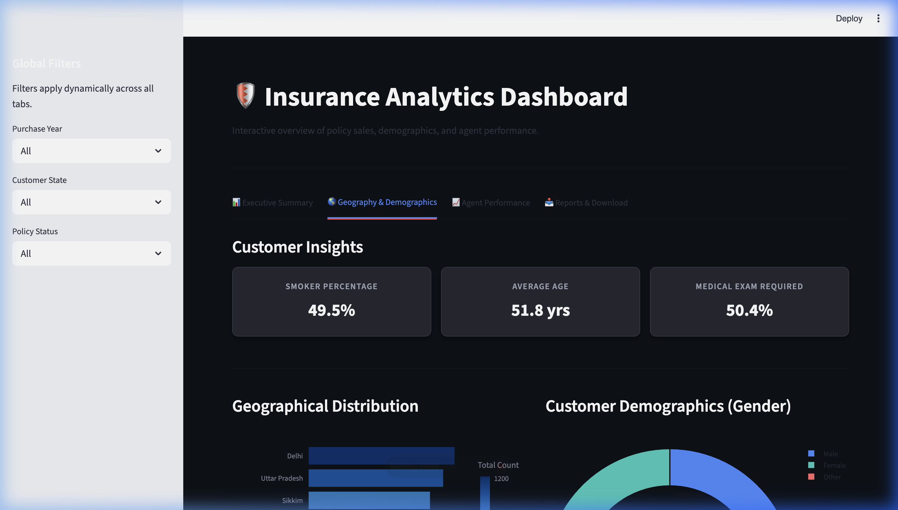
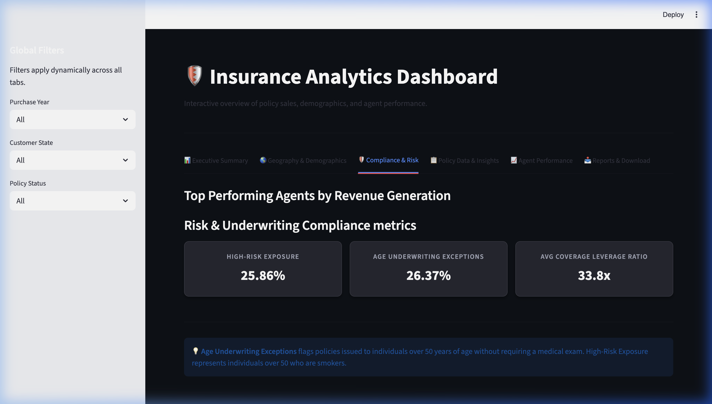
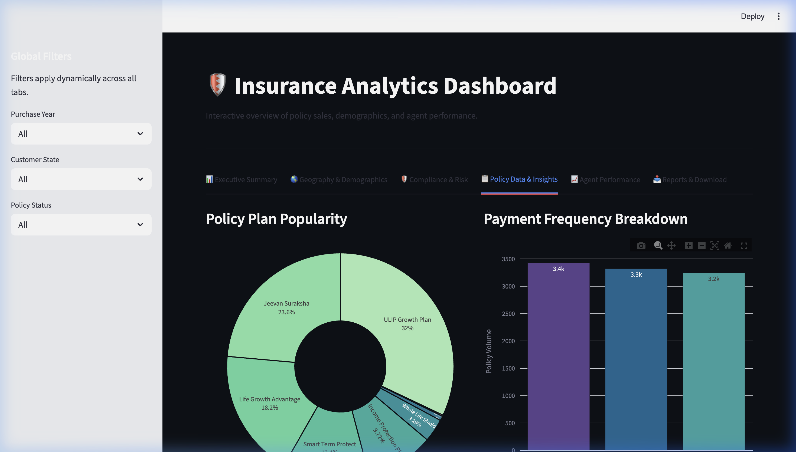

# Insurance Analytics Dashboard

An interactive and dynamic data analytics dashboard built with **Streamlit**, **Pandas**, and **Plotly**. This platform provides stakeholders with deep insights into insurance policy compliance, demographic distributions, agent performance, and underwriting risk.

## 🌟 Key Features

The dashboard is structured into several analytical tabs simulating advanced Power BI DAX-style measures within a custom Python-driven interface:

*   **📊 Executive Summary:** High-level metrics encompassing Gross Written Premiums, Active Policies, and Claims Ratios dynamically sliced by geography and temporal filters.
*   **🌎 Geography & Demographics:** Deep-dive into patient age segments, state-level performance, and dynamic Power BI-style KPI cards (Smoker %, Average Age, Medical Exam requirements).
*   **🛡️ Compliance & Risk:** Proactive underwriting surveillance tracking High-Risk Customer Exposures, Age Compliance Exceptions, and Average Coverage Leverage Ratios.
*   **📋 Policy Data & Insights:** Analysis of specific Policy Protection Plans (e.g., ULIP Growth vs. Jeevan Suraksha) and tracking payment frequency behaviors.
*   **📈 Agent Performance:** Evaluates top-performing direct sales agents based on total premiums collected.
*   **📥 Reports & Download:** Generates on-the-fly downloadable CSV reports respecting all active sidebar filtering criteria.

## 📸 Dashboard Snapshots

### 1. 📊 Executive Summary & Power BI-Style Demographics


### 2. 🛡️ Compliance, Risk, & Policy Analytics



## 🛠️ Technology Stack

*   **Python:** Core logic and data transformation layer.
*   **Streamlit:** Web application framework delivering the UI/UX.
*   **Pandas:** Efficient data merging, grouping, and aggregation of complex relational factual data.
*   **Plotly (Express/Graph Objects):** Interactive, responsive visualizations styled with dark-mode corporate themes.

## 🚀 Running Locally

1. Ensure you have Python installed.
2. Clone this repository:
   ```bash
   git clone https://github.com/ashim1600/Insurance-Analytics-Dashboard-.git
   cd Insurance-Analytics-Dashboard-
   ```
3. Install the required dependencies:
   ```bash
   pip install streamlit pandas plotly pillow
   ```
4. Run the Streamlit application:
   ```bash
   streamlit run app.py
   ```
5. Open your browser to `http://localhost:8501/` to view the dashboard.

## 📁 Data Architecture
The application dynamically merges several CSV datasets mirroring a star-schema data warehouse design:
*   `FCT.Insurance_Policy_Table.csv` (Fact Table)
*   `DM.Customer_Detail_Table 1.csv` (Dimension)
*   `DM.Insurance_Agent_Table.csv` (Dimension)
*   `DM.Policy_Protection_Plan.csv` (Dimension)
*   `DM.Policy_Type.csv` (Dimension)
